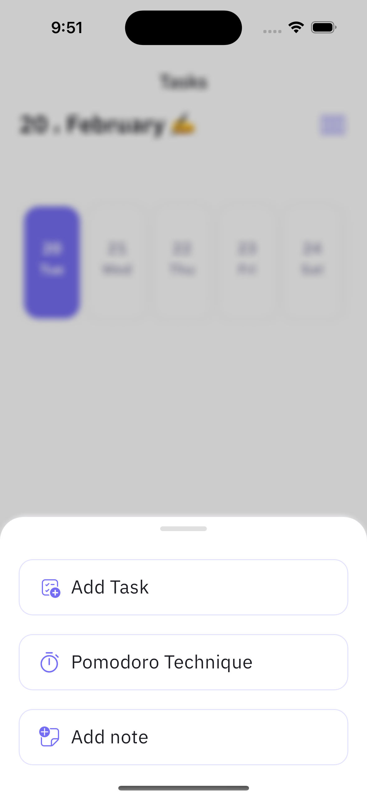

# Dahih App
 Task manager for students to manage their tasks and assignments and time table

------------------
### 👨‍💻 *Developed  by:*


**Nasr Al-Rahbi [@abom_me](https://twitter.com/abom_me)**

## 👨🏻‍💻 Find me in  :
[](https://twitter.com/abom_me)
[](https://instagram.com/abom.me)
[](https://linkedin.com/in/nasr-al-rahbi-08a573245)
[](https://stackoverflow.com/users/19994059/nasr-al-rahbi)
-----


## Installation
```bash
gh repo clone abom-me/dahih_app
```

## Features
- [x] Add Task
- [x] Remaining Time for the task
- [x] Add Time Table
- [x] Add Notes
- [x] Add Exams Table
- [x] horizontal and vertical view for the tasks
- [x] Real Time LocalData Storage
- [x] Dark Mode
- [x] Languages (Arabic, English)
- [x] Notifications
- [x] Pomodoro Timer

And a lot more


# Packages

 - flutter_riverpod
- flutter_svg
- shared_preferences
- fluentui_system_icons
- intl
- shimmer
- date_format
- uuid
- color_hex
- localstore
- flutter_local_notifications
- flutter_native_timezone
- path_provider
- url_launcher
- keyboard_actions


# Screenshots




